# Linux Fundamental for Hackers

## **Topics**

- Introduction
- The Shell
- System Management
- Workflow

# Introduction

## Linux Structure

### History

- The Linux operating system (OS), starting with the Unix Operating System's release by Ken Thompson and Dennis Ritchie (whom both worked for AT&T at the time) in 1970.

- The Berkeley Software Distribution (BSD) was released in 1977, but since it contained the Unix code owned by AT&T, a resulting lawsuit limited the development of BSD.

- Richard Stallman started the GNU project in 1983. His goal was to create a free Unix-like operating system, and part of his work resulted in the GNU General Public License (GPL) being created.

- At first, Linux was a personal project started in 1991 by a Finnish student named Linus Torvalds. His goal was to create a new, free operating system kernel.

- Over the years, the Linux kernel has gone from a small number of files written in C under licensing that prohibited commercial distribution to the latest version with over 23 million source code lines (comment excluded), licensed under the GNU General Public License v2.

- Linux is available in over 600 distributions (or an operating system based on the Linux kernel and supporting software and libraries).

- Some of the most popular and well-known being Ubuntu, Debian, Fedora, OpenSUSE, elementary, Majaro, Gentoo Linux, Redhat, and Linux Mint.

- Linux is generally considered more secure than other operating systems, and while it has had many kernel vulnerabilities in the past, it is becoming less and less frequent.

- It is less susceptible to malware than Windows operating systems and is very frequently updated.

- Linux is also very stable and generally affords very high performance to the end-user.

- Since Linux is free and open-source, the source code can be modified distributed commercially or non-commercially by anyone.

- Linux-based operating systems run on servers, mainframes, desktops, embedded systems such as routers, televisions, video game consoles, and more.

- The overall Android operating system that runs on smartphones and tablets is based on the Linux operating system that runs on smartphones and tablets is based on the Linux kernel, and because of this, Linux is the most installed operating system.

- Linux is an operating system like Windows, IOS, Android, or macOS. An OS is software that manages all of the hardware resources associated with our computer. That means an OS manages the whole communication between software and hardware.

### Philosophy

Linux follows five core principles:

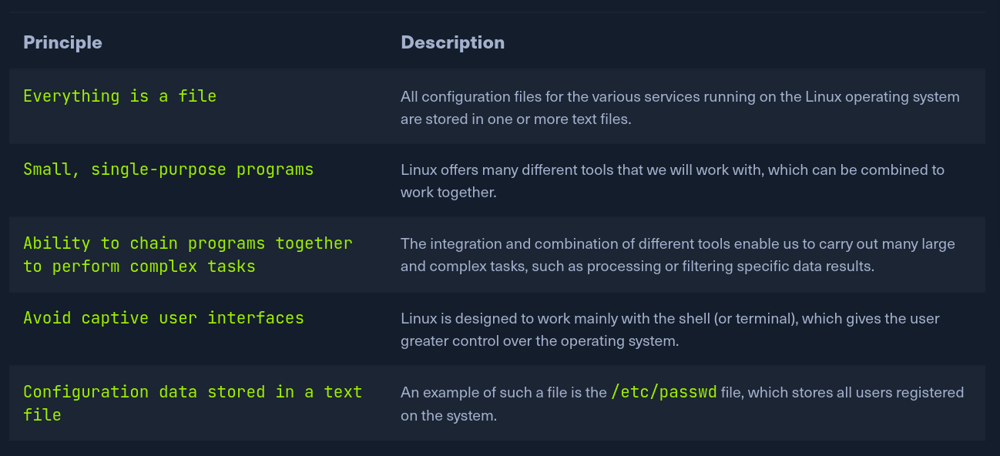

### Component

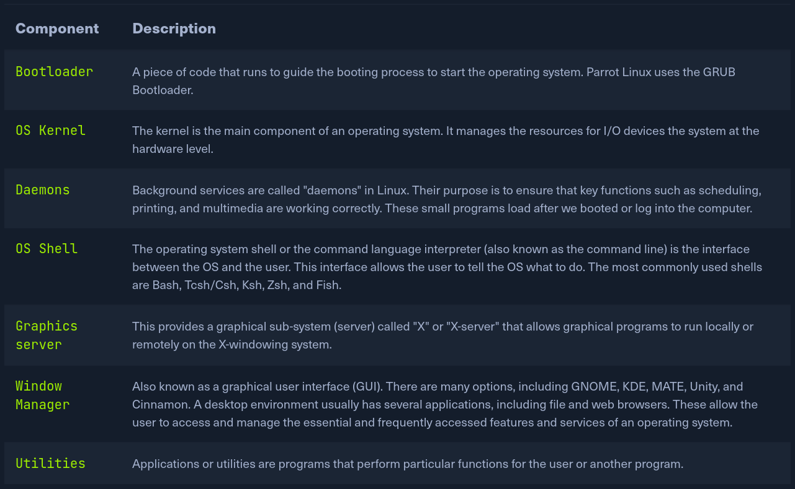

### Linux Architecture

The linux operating system can be broken down into layers:

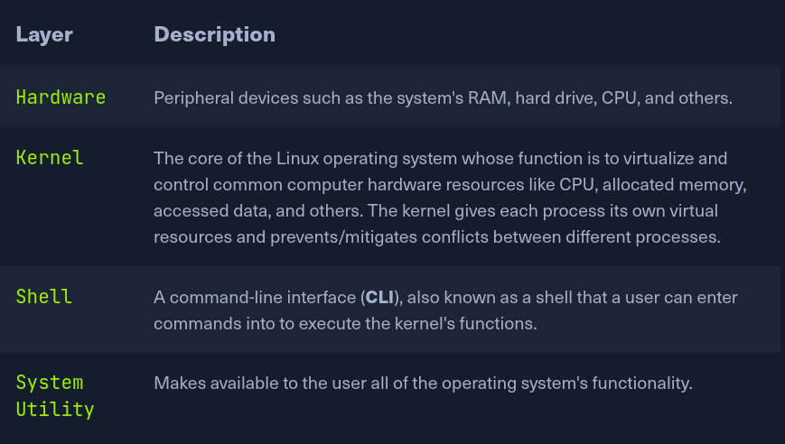

### File System Hierarchy

The Linux operating system is structures in a tree-like hierarchy and is documented in the **Filesystem Hierarchy** Standard(FHS). Linux is structured with the following standard top-level directories:

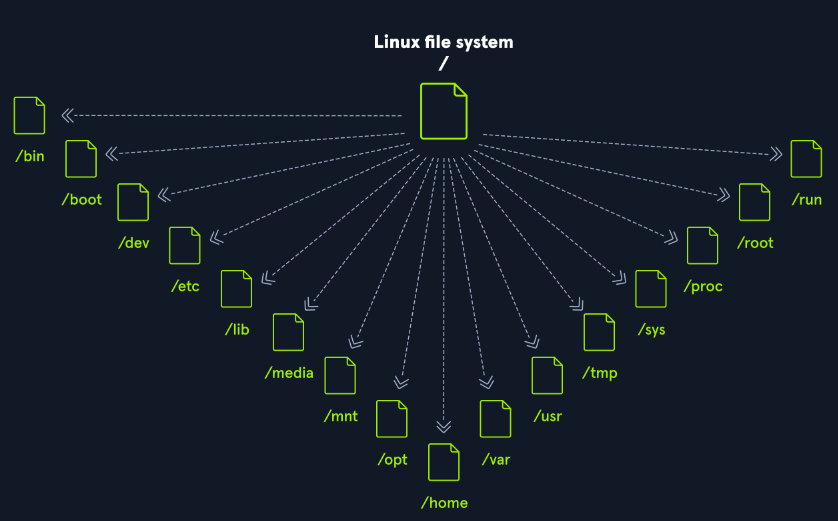

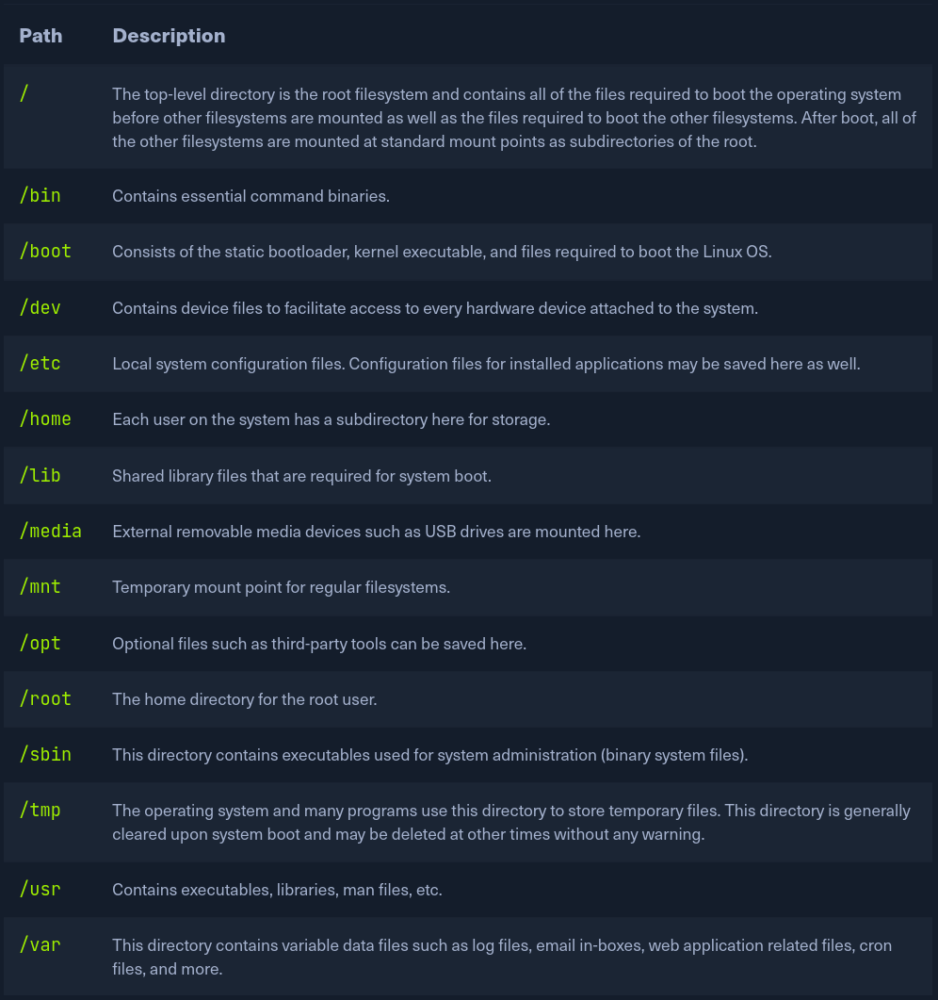

## Introduction to the Shell

### Shell

- A Linux terminal, also called a **shell** or commandline, provides a text-based input/output (I/O) interface between users and the kernel for a computer system. The term console is also typical but does not refer to a window but a screen in text mode. In the terminal window, commands can be executed to control the system.

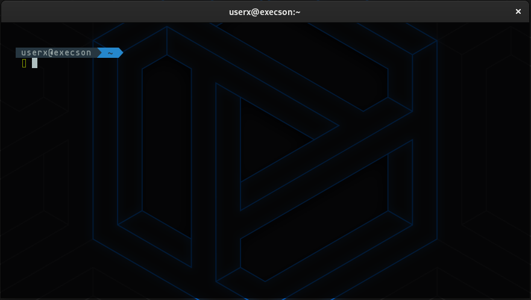

### Terminal Emulators

- Terminal emulators are often used for this. Terminal emulation is software that emulates the function of a terminal. It is used to be able to use text-based programs within a graphical user interface.

- Many different terminal emulators exist, such as **GNOME Terminal, Alacritty, rxvt, XTerm** and many more.

- There are also so-called command-line interfaces that run as additional terminals in one terminal and thus are **multiplexers**. These multiplexer include **Tmux, GNU Screen,** and others. In short, a terminal serves as an interface to the shell interpreter.

- Terminal emulators and multiplexers are beneficial extentions for the terminal. They provide us with different methods and functions to work with the terminal, such as splitting terminal in one window, working in multiple directories, creating different workspaces, and much more.

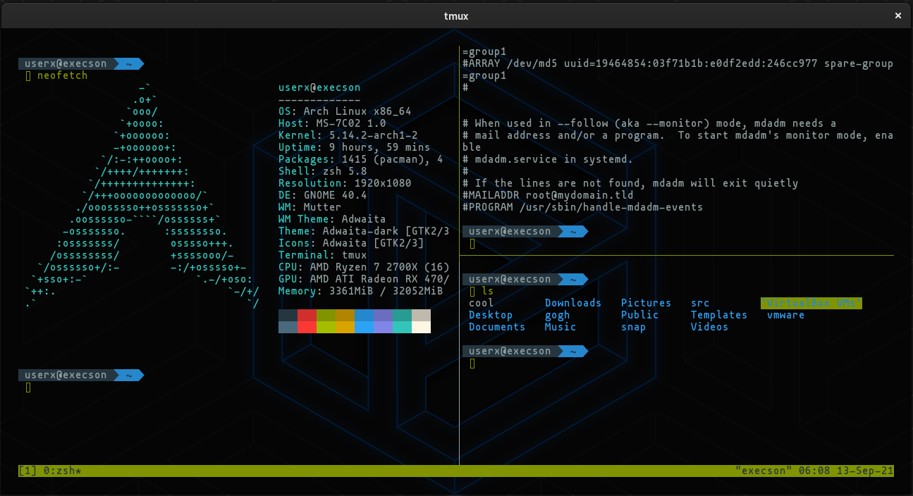

### Shell

- The most commonly used shell in Linux is the **Bourne-Again Shell (BASH)** and is part of the GNU project. Everything we do through the GUI we can do with the shell. The shell gives us many more possibilities to interact with programs and processes to get information faster.

- Besides, many processes can be easily automated with smaller or larger scripts that make manual work much easier.

- Like BASH, there are also some other shells like **Tcsh/Csh, Ksh, Zsh, Fish** shell, and others.

## The Shell

### Prompt Description

- The bash prompt is easy to understand and, by default, includes information such as the user, hostname, and current working directory. The format can look something like this:

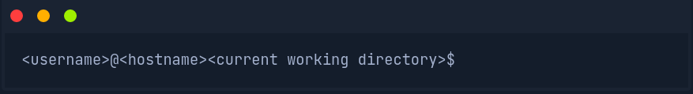

- The home directory for a user is marked with a tilde <**~**> and is the default folder when we log in.

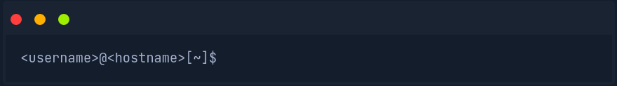

- The dollar sign, in this case, stands for a user. As soon we log in as **root**, the character changes to a **hash** <**#**> looks like this:

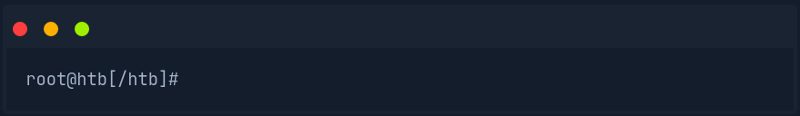

### Getting Help

- The first two ways are the **man** pages and the **help** functions.

- In, the man pages, we will find the detailed manuals with detailed explanations.

```
user@hostname$ man <tool>
```

Let us have a look at an example:

**Example**

```
user@hostname$ man curl
```

After looking at some examples, we can also quickly look at the optional parameters without browsing through the complete documentation. We have several ways to do that.

**Syntax**

```
user@hostname$ curl --help
```
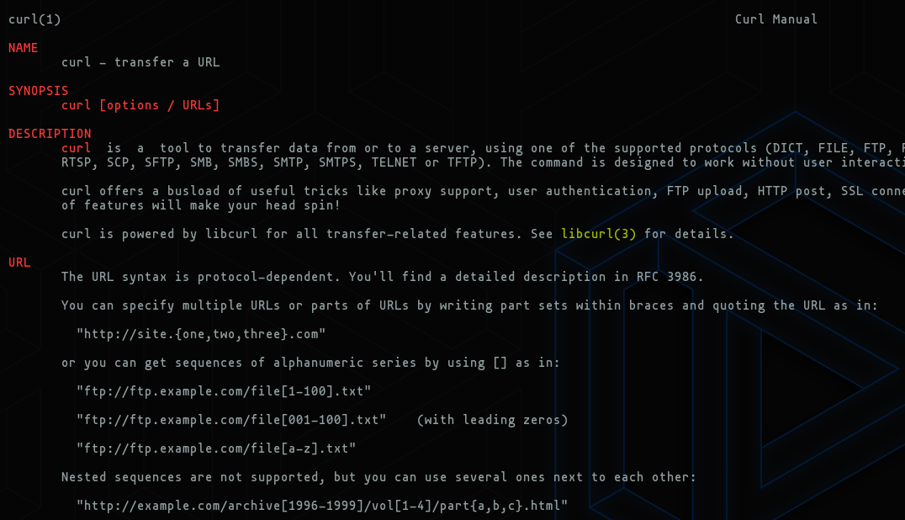

- Short version of help:

```
user@hostname$ -h
```
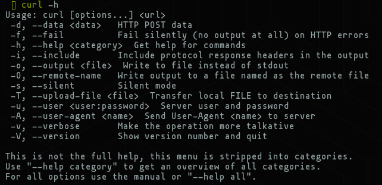

- Another tool that can be useful in the beginning is **appropos**.

**Syntax**

```
user@hostname$ apropos <keyword>
```

**Example**

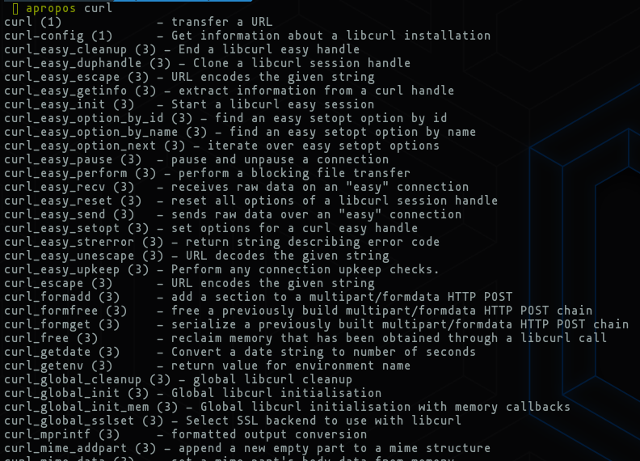

### System Information

| Command | Description 
|---------|-------------
| whoami | Display current username.
| id | Returns users identity
| hostname | Sets or prints the name of current host system.
| uname | Prints basic information about the operating system name and system hardware.
| pwd | Returns working directory name.
| infconfig | The ifconfig utility is used to assign or to view an address to a network interface and/or configure network interface parameters.
| ip | Ip is a utility to show or manipulate routing, network devices, interfaces and tunnels.
| netstat | Shows network status.
| ss | Another utility to investigate sockets.
| ps | Shows process status.
| who | Displays who is logged in.
| env | Prints environment or sets and executes command.
| lsblk | Lists block devices.
| lsusb | Lists USB devices.
| lsof | List opened files.
| lspci | Lists PCI devices.

**Hostname**

The **hostname** command is pretty self-explanatory and will just prints the name of the computer that we are logged into

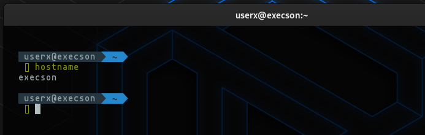

**Whoami**

- This quick and easy command can be used both on Windows and Linux systems to get our current username.

- During a security assesment, we obtain reverse shell access on a host, and one of the first bits of situational awareness we should do is figuring out what user we are running as.

- So that, we can figure out if the user has any special privileges/access.

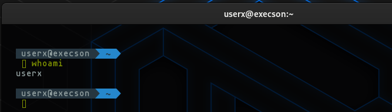

**Id**

- The **id** command expands on the **whoami** command and prints out our effective group membership and IDs. This can be of interest to penetration testers looking to see what access a user may have and sysadmins looking to audit account permissions and group membership.

- In this output, the **hackthebox** group is of interest because it is non-standard, the **adm** group means that the user can read log files in **/var/log** and could potentially gain access to sensitive information.

- Membership in the **sudo** group is of particular interest as this means our user can run some or all commands as the the powerful **root** user. Sudo rights could help us escalate privileges or could be a sysadmin that they may need to audit permissions and group memberships to remove any access that is not required for a given user to carry out their day-to-day tasks.

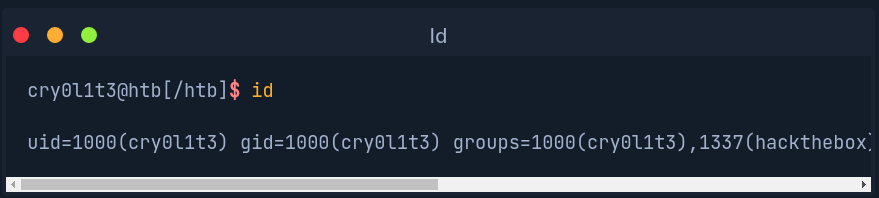

**Uname**

- Running **uname -a** will print all information about the machine in a specific order: kernel name, hostname, the kernel release, kernel version, machine hardware name, and operating system.

- The **-a** flag will omit **-p**(processor type) and **-i**(hardware platform) if they are unkown.

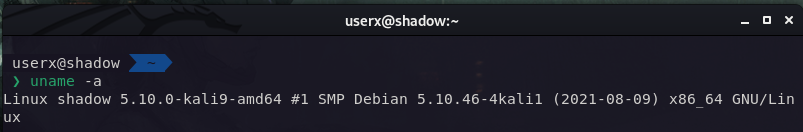

- From the above command, we can see that kernel name is **Linux**, the hostname is **shadow**, the kernel release is **#1 SMP Debian 5.10.46-4kali1 (2021-08-09)**, the kernel version is **5.10.0-kali9-amd64**, and so on.

**Uname to Obtain Kernel Release**

- type **uname -r** to obatain this information.

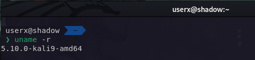

**Logging in via SSH**

- **Secure Shell(SSH)** refers to a protocol that allows client to access and execute commands or actions on remote computers.

- On linux-based hosts and servers running or another Unix-like operating system, SSH is one of the permanently installed standard tools and is the prefered choice for many administrations to configure and maintain a computer through remote access.

- It is an older and very proven protocol that does not require or offer a graphical user interface (GUI). For this reason, it works very efficiently and occupies very few resources.

- We can connect to our targets with the following command:

**SSH Login**
 
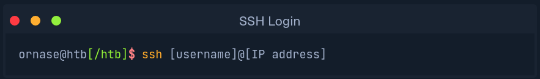

## System Management

### User Management

**Execution as a user**

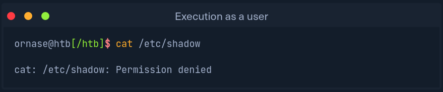

**Execution as a root**

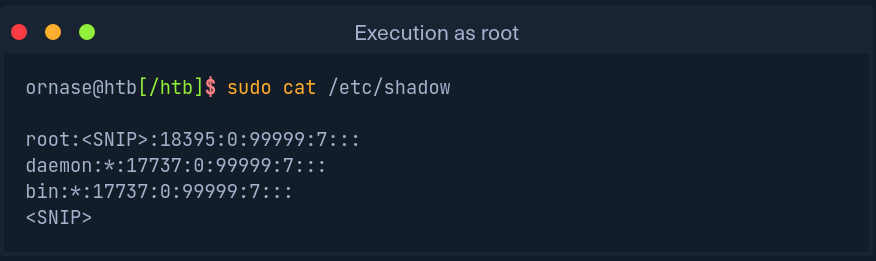

- Here is a list that will help us to better understand and deal with user management.

| Command | Description
|---------|------------
| sudo    | Execute command as a different user. 
| su      | The **su** utility requests appropriate user credential via PAM and switches to that user ID (the default user is the superuser). A shell is then executed. 
| useradd | Creates a new user or update default new user information. 
| userdel | Deletes a user account and related files. 
| usermod | Modifies a user account. 
| addgroup| Adds a group to the system. 
| delgroup| Removes a group from the system. 
| passwd  | Changes user password.

- User management is essential in any operating system, and the best way to become familiar with it is to try out the individual commands in conjunction with their various options.

### Package Management

- Packages are archives that contain binaries of software, configuration files, information about dependencies and keep track of updates and upgrades.

- The features that most package management systems provide are:
	- Package downloading
	- Dependency resolution
	- A standard binary package format
	- Common installation and configuration locations
	- Additional system-related configuration and functionality
	- Quality control

- The package management requirement is the software to be installed is available as a corresponding package.

- Typically this is created, offered, and maintained centrally under Linux distributions.

- In this way, the software is integrated directly into the system, and its various directories are distributed throughout the system.

- The package management software changes to the system to install the package are taken from the package and implemented by the package management software.

- If the package management software recognizes that additional packages are required for the proper functioning of the packages that has not yet been installed, a dependency is included and either warn the administrator or tries to reload the missing software from a repository, for example, and install it in advance.
